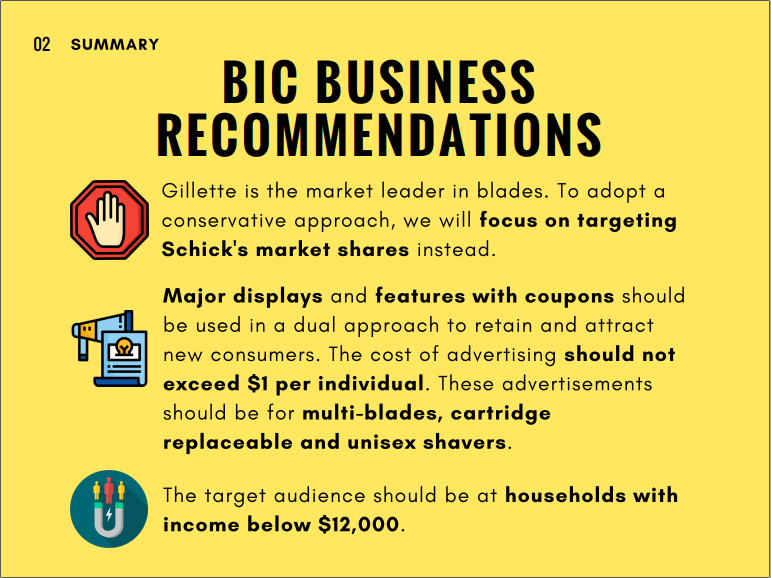
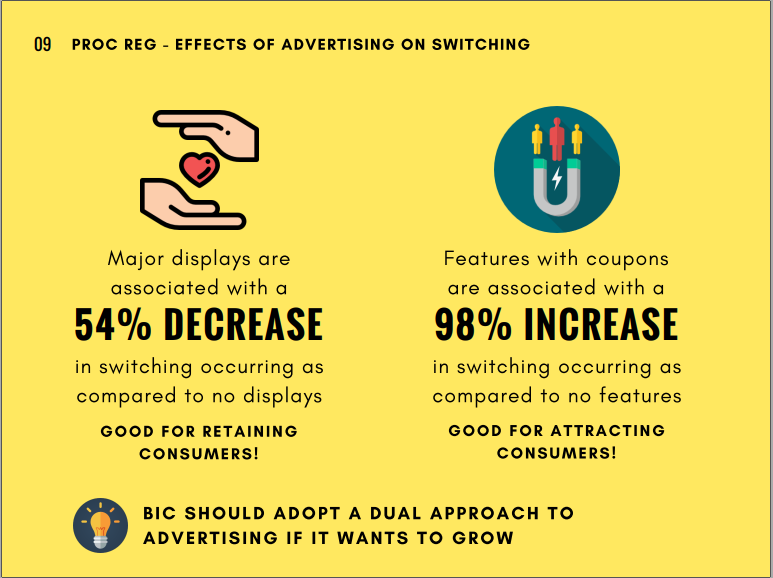
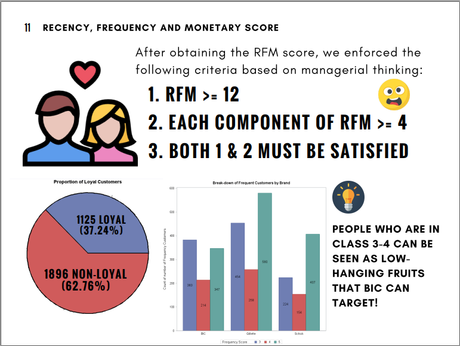
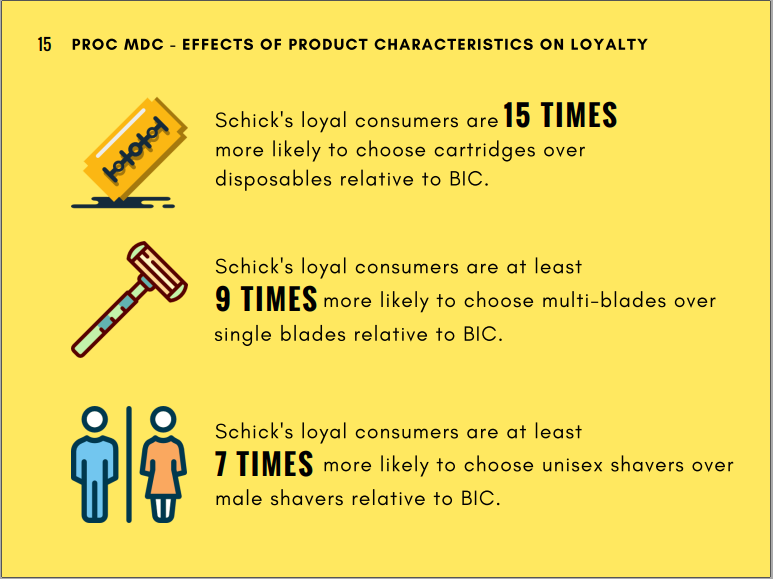
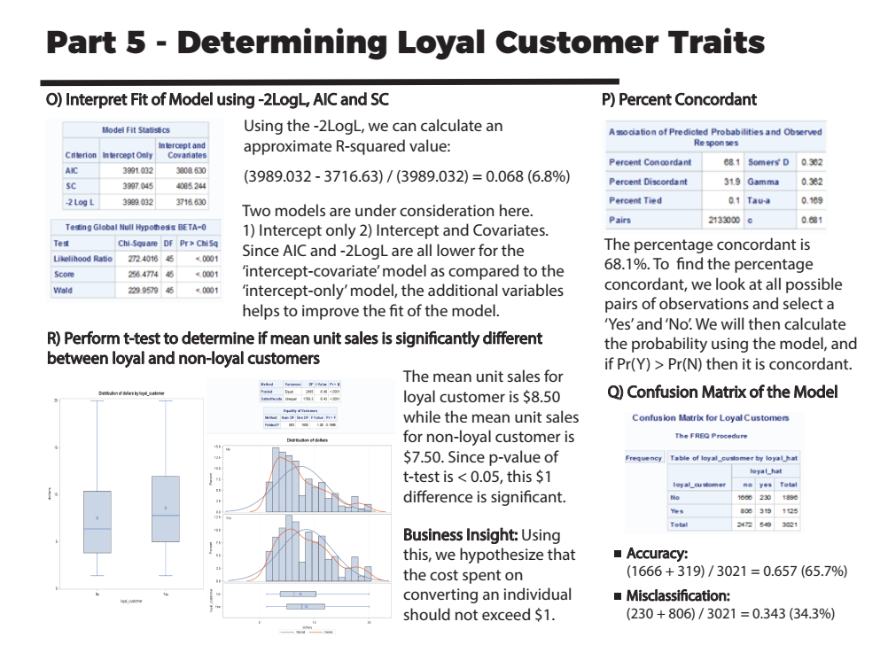

# Shaving Blades Market Analysis
> An analysis of the shaving blades market in the United States. 
The project was done as part of Predictive Analysis class at the University of Texas at Dallas.
The final presentation for the report can be found in [project presentation](https://github.com/harshbg/Shaving-Blades-Analysis/blob/master/Group03_Presentation(Print).pdf).
The entire summary of the project can be found in the [project report](https://github.com/harshbg/Shaving-Blades-Analysis/blob/master/Group03_FinalReport.pdf).

## Table of contents
* [General info](#general-info)
* [Screenshots](#screenshots)
* [Technologies and Tools](#technologies-and-tools)
* [Setup](#setup)
* [Code Examples](#code-examples)
* [Features](#features)
* [Status](#status)
* [Inspiration](#inspiration)
* [Contact](#contact)

## General info
The dataset consists of sales data for various brands of shaving blades sold in the United States. 
We have analyzed the data from the stand point of one of the prime blade manufacturer "BIC" to provide insights that can help them increase their revenue. 
Our analysis is focussed on providing answers to four questions using the data provided. 


## Screenshots






**The entire presentation of the project can be found in [project presentation](https://github.com/harshbg/Shaving-Blades-Analysis/blob/master/Group03_Presentation(Print).pdf) and entire research findings can be found in [project report](https://github.com/harshbg/Shaving-Blades-Analysis/blob/master/Group03_FinalReport.pdf).**

## Technologies and Tools
* SAS
* Microsoft Excel

## Setup

The data used for the analaysis and its metadata can be found in the [dataset](https://github.com/harshbg/Shaving-Blades-Analysis/tree/master/Data) folder. 
The entire code has been provided [here](https://github.com/harshbg/Shaving-Blades-Analysis/blob/master/Project_New.sas) can be used in latest version of SAS to run replicate various operations provided and see the various outputs generated. 
A detailed explaination of the various operations and the interpretition of the outputs can be found in the [project report](https://github.com/harshbg/Shaving-Blades-Analysis/blob/master/Group03_FinalReport.pdf). 


## Code Examples

````
/*Investigating Product type = Razor Blades*/
proc freq data=a4;
where product_type = 'RAZOR BLADE';
table L2*product_type;
run;

proc freq data=a4;
table product_type;
run;

data a4;
set a4;
drop product_type;
run;

data a4;
set a4;
if L2 = 'CARTRIDGES' then type = 0;
else type = 1;
run;

proc format;
value type 0 = 'Cartridges';
value type 1 = 'Disposable';
run;
````

````
/*Running Logistic Regression*/
/*Using data=L1*/
proc print data=L1 (obs=10); run; quit;

/*Testing for Non-linearity*/
data L1;
set L1;
total_weightedprice2 = total_weightedprice*total_weightedprice;
run;

data L1;
set L1;
vol_eq2 = vol_eq*vol_eq;
run;

/*Business Logistic Regression*/
title1 'Refining Business Logistic Regression for Loyalty using Stepwise Selection';
proc logistic data=L1 outmodel=betas1 desc;
	class outlet agm agf ethnicity status inc_status marital kids status / param=ref;
	model loyal_customer = outlet agm agf ethnicity status inc_status marital kids status / selection=stepwise slentry= 0.3 slstay=0.2 expb;
    output out=preds predprobs=individual;
run;

````

````
/*k-means clustering*/
/*the difference between hierachical - k-means is an iterative o(n) operation; hierachical is looking based on distances o(n2) operation*/
/*proc fastclus data=clus3 maxclusters=3 maxiter=20 list;
id panid;
var recency_score frequency_score monetary_score;
run;

proc fastclus data=clus3 maxclusters=4 maxiter=20 list;
id panid;
var recency_score frequency_score monetary_score;
run;

proc fastclus data=clus3 maxclusters=5 maxiter=20 list;
id panid;
var recency_score frequency_score monetary_score;
run;*/
````

The entire code can be found [here](https://github.com/harshbg/Shaving-Blades-Analysis/blob/master/Project_New.sas).

## Features
We have answered four questions as follows: 
* Effects of Advertising on unit sales
* Effects of Advertising on product switching
* Effects of Demographics on product loyalty 
* Effects of Product Characteristics on product loyalty

Please refer to project presentation for detailed answers to the questions. 

## Status
Project is: _finished_

## Inspiration
The color theme for the project presentation is inspired by the brand color of "BIC", our assumed client in the analysis. 

## Contact
Created by me and my teammates Weiyang Sun, Gongzhan Hua, and Mengyun Xia.
Feel free to contact me! My other projects can be found [here](http://www.gupta-harsh.com/projects/).